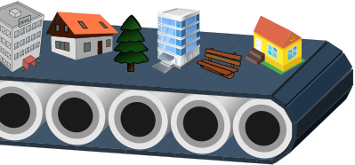

# CityJSONSeq (CityJSON Text Sequences)



## Table of contents
{: .no_toc .text-delta }

1. TOC
{:toc}

- - -

CityJSON Text Sequence---*CityJSONSeq* for short---is a format based on [JSON Text Sequences](https://datatracker.ietf.org/doc/html/rfc7464) and CityJSON, inspired by [GeoJSON Text Sequences](https://datatracker.ietf.org/doc/html/rfc8142).
The idea is to decompose a (often large) CityJSON dataset into its features (eg each building, each bridge, each road, etc.), to create several JSON objects (of type [`CityJSONFeature`](https://www.cityjson.org/specs/#text-sequences-and-streaming-with-cityjsonfeature)), and stream/store them in a JSON Text Sequence (for instance [ndjson -- newline delimited JSON](https://github.com/ndjson/ndjson-spec/)).


## CityJSONSeq specifications

We follow the specifications of *[ndjson -- newline delimited JSON](https://github.com/ndjson/ndjson-spec/)* and we add 2 constraints (#4 and #5):

  1. each JSON Object must conform to the [JSON Data Interchange Format specifications](https://datatracker.ietf.org/doc/html/rfc8259) and be written as a UTF-8 string;
  2. each JSON Object must be followed by a new-line (LF: `'\n'`) character, and it may be preceded by a carriage-return (CR: `'\r'`);
  3. a JSON Object must not contain the new-line or carriage-return characters;
  4. the first JSON Object must be of type `'CityJSON'` (see below for details);
  5. the following JSON Objects must be of type `'CityJSONFeature'`;

{: .highlight }
 **Suggested convention**: we recommend using the extension `.city.jsonl` when saving the JSON Objects to a file.


## CityJSONFeature

A `CityJSONFeature` object represents **one** feature in a CityJSON object, for instance a `"Building"` (with eventually its children `"BuildingPart"` and/or `"BuildingInstallation"`).
The idea is to decompose a large area into each of its features, and each feature is a stored as a `CityJSONFeature`.
Each feature is independent and has its own list of vertices (which is thus local).

See the [full specifications for a CityJSONFeature](https://www.cityjson.org/specs/#text-sequences-and-streaming-with-cityjsonfeature).

```json
{
  "type": "CityJSONFeature",
  "id": "id-1", 
  "CityObjects": {
    "id-1": {
      "type": "Building", 
      "attributes": { 
        "roofType": "gabled roof"
      },
      "children": ["mypart"],
      "geometry": [...]
    },
    "mypart": {
      "type": "BuildingPart", 
      "parents": ["id-1"],
      "children": ["mybalcony"],
      "geometry": [...]
    },
    "mybalcony": {
      "type": "BuildingInstallation", 
      "parents": ["mypart"],
      "geometry": [...]
    }
  },
  "vertices": [...]
}
```


## Streaming 3D cities with CityJSONSeq

To be able to reconstruct the features and geo-reference them, some properties are necessary, eg [`"transform"`](https://www.cityjson.org/specs/#transform-object), the [CRS](https://www.cityjson.org/specs/#referencesystem-crs) or [`"geometry-templates"`](https://www.cityjson.org/specs/#geometry-templates).
Thus those need to be known by the client/software parsing the stream.

The first JSON Object should therefore be of type `"CityJSON"` and contain the necessary information.
Notice that the properties `"CityObjects"` and `"vertices"` are mandatory (for the [JSON Object to be valid](https://www.cityjson.org/specs/#cityjson-object)) but should be respectively an empty JSON object and an empty array.
Here's one example:
```json
{"type":"CityJSON","version":"2.0","transform": {"scale":[1.0,1.0,1.0],"translate": [0.0, 0.0, 0.0]},"metadata":{"referenceSystem":"https://www.opengis.net/def/crs/EPSG/0/7415"},"CityObjects":{},"vertices":[]}
```

The subsequent JSON Objects must all be of type `"CityJSONFeature"`, which means a CityJSONSeq with 3 features looks like this one (it has 4 lines):

```json
{"type":"CityJSON","version":"2.0","transform": {"scale":[1.0,1.0,1.0],"translate": [0.0, 0.0, 0.0]},"metadata":{"referenceSystem":"https://www.opengis.net/def/crs/EPSG/0/7415"},"CityObjects":{},"vertices":[]}
{"type":"CityJSONFeature","id":"a","CityObjects":{...},"vertices":[...]} 
{"type":"CityJSONFeature","id":"b","CityObjects":{...},"vertices":[...]} 
{"type":"CityJSONFeature","id":"c","CityObjects":{...},"vertices":[...]} 
```


## Reading and writing CityJSONSeq with cjseq

The software [cjseq](https://github.com/cityjson/cjseq) allows us to convert between CityJSON and CityJSONSeq, and vice-versa
.
cjseq has at the moment 3 commands: 

  1. cat: CityJSON ==> CityJSONSeq
  2. collect: CityJSONSeq ==> CityJSON
  3. filter: to filter a stream based on feature type, bounding box, distance to a location, etc.

We can create a CityJSONSeq stream (with the first line containing the metadata) this way:

```sh
cjseq cat -f myfile.city.json > myfile.city.jsonl
```

And conversely convert a stream to a CityJSON file:

```sh
cat myfile.city.jsonl | cjseq collect > myfile.city.json
```


## CityJSONSeq examples

| dataset | CityJSONSeq file | description |  
| ------- | ---------------- | ----------- |
| 3DBAG   | [3dbag_b2.city.jsonl](https://3d.bk.tudelft.nl/opendata/cityjson/cityjsonseq/3dbag_b2.city.jsonl) | 2 buildings randomly selected from the 3DBAG, LoD2.2 only |
| Montréal   | [montréal_b4.city.jsonl](https://3d.bk.tudelft.nl/opendata/cityjson/cityjsonseq/montréal_b4.city.jsonl) | 4 buildings randomly selected from the Montréal dataset |


## Validating a stream

### With the online validator

The [official schema-validator of CityJSON](https://validator.cityjson.org) accepts CityJSONSeq files, if they are structured as above ([3dbag_b2.city.jsonl](https://3d.bk.tudelft.nl/opendata/cityjson/cityjsonl/3dbag_b2.city.jsonl) and [montréal_b4.city.jsonl](https://3d.bk.tudelft.nl/opendata/cityjson/cityjsonl/montréal_b4.city.jsonl) are two examples).

You can just drop those files and the validator will indicate, *per line*, if the `CityJSONFeature` are valid, or not.

[](https://validator.cityjson.org)


### Locally with cjval

The official [schema-validator of CityJSON (called cjval)](https://github.com/cityjson/cjval) can validate CityJSONSeq streams.
Each line is individually validated and errors reported:

```sh
cjseq cat -f myfile.city.json | cjval --verbose
1   ✅ [1st-line for metadata] 
2   ✅ [NL.IMBAG.Pand.0503100000019581]
3   ❌ [NL.IMBAG.Pand.0503100000014639] Additional properties are not allowed ('CityObject' was unexpected) [path:] "CityObjects" is a required property [path:] |
4   ✅ [NL.IMBAG.Pand.0503100000005139]
...
61  🟡 [NL.IMBAG.Pand.0503100000020017] Vertex (185470, 295278, 4110) duplicated | Vertex #24 is unused |
62  ✅ [NL.IMBAG.Pand.0503100000034978]
```


## cjseqview: a small viewer for CityJSONSeq


The [cjseqview GitHub repository](https://github.com/cityjson/cjseqview/) has more details.


It reads a [CityJSONSeq](https://cityjson.org/cityjsonseq) from stdin.

```sh
cat ./data/b2.city.jsonl | python ./src/cjseqview.py
```

```sh
cat NYC.city.jsonl | cjseq filter --random 10 | python ./src/cjseqview.py`
```
