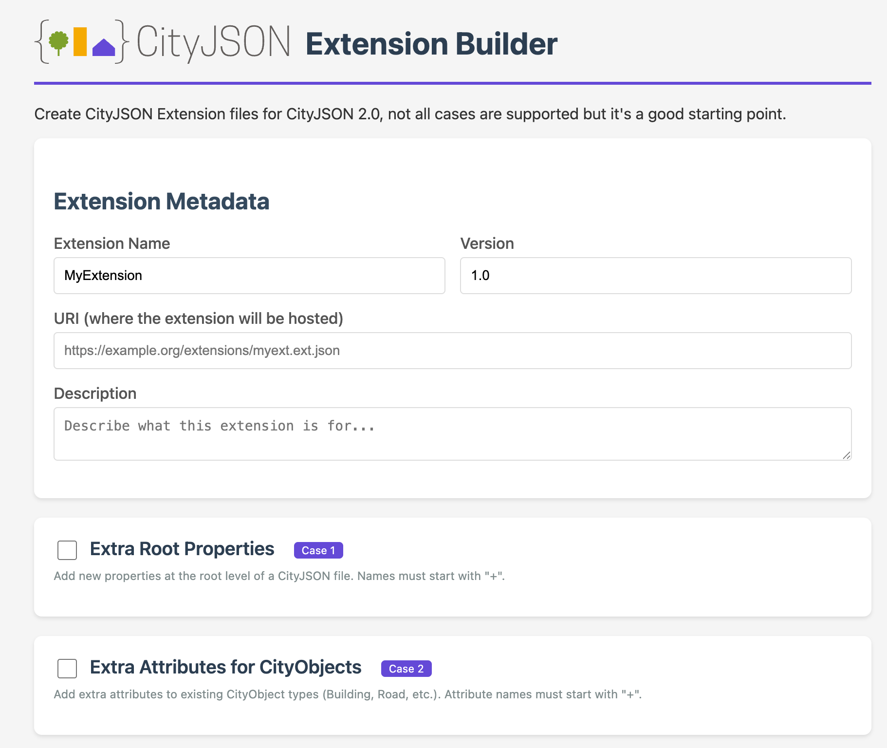
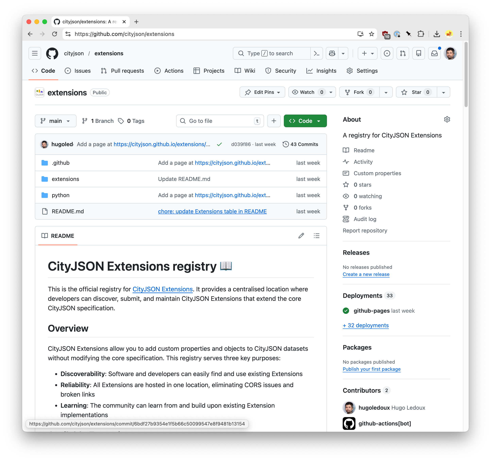

# Extensions

## Table of contents
{: .no_toc .text-delta }

1. TOC
{:toc}

---

CityJSON uses [JSON Schemas](http://json-schema.org/) to document and validate the data model, schemas should be seen as basically validating the syntax of a JSON document.

A CityJSON *Extension* is a JSON file that allows us to document how the core data model of CityJSON may be extended, and to validate CityJSON files containing new objects and/or attributes.
This is conceptually akin to the *Application Domain Extensions* (ADEs) in CityGML; see Section 10.13 of the [official CityGML documentation](https://portal.opengeospatial.org/files/?artifact_id=47842).

[<i class="fas fa-external-link-alt"></i> CitySON v2.0 Extension specifications](https://www.cityjson.org/specs/#extensions)

## How to create an extension?

[{:width="400px"}]({{ site.url }}{{ site.baseurl }}/extensions/builder/)

We offer an [Extension builder]({{ site.url }}{{ site.baseurl }}/extensions/builder/) to create (simple) Extension files.

For more complex files, you will need to manually build them by modifying the output of the builder or building from manually.
See the [Extensions specifications for v{{site.lastversion}}]({{ site.url }}{{ site.baseurl }}/specs/#extensions) for an overview of how the file should be structured and the possibilities.

Also, this [tutorial to create a noise extension]({{ '/tutorials/extension/' | prepend: site.baseurl }}) guides you through the process, and explains how to validate the extension itself and datasets that uses the extension.

As a template/example, you can have a look at an [Extension for CityJSON v2.0 having `+GenericCityObect` with a new semantic surface]({{ '/extensions/download/v20/generic.ext.json' | prepend: site.baseurl }}).

## Registry of Extensions

CityJSON has an official Extension registry: <https://github.com/cityjson/extensions>.

Once your Extension is working, we advise you to add it to the repository so that others can 

  1. get to know it exists!
  2. learn from it when building their own Extensions
  3. use it seamlessly by hosting it (no CORS drama)

[{:width="600px"}](https://github.com/cityjson/extensions)
