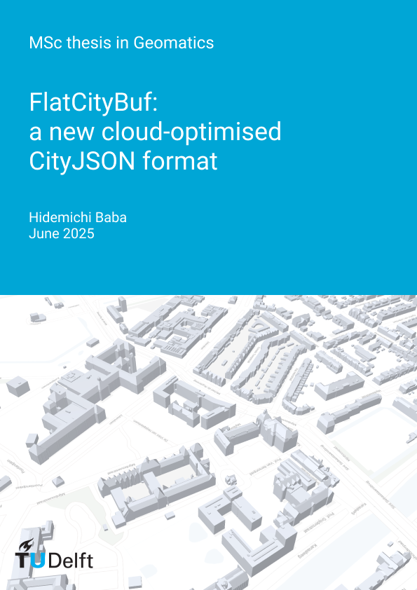

<h1>{{ page.title }}</h1>

[{:width="250px"}](https://github.com/cityjson/flatcitybuf)

**FlatCityBuf** is a new cloud-optimised format for 3D city models based on [FlatBuffers](https://flatbuffers.dev/) and CityJSON.

## Key Features

- **Zero-copy data access**: Efficient memory usage without data copying
- **Fast deserialisation**: 9-250× faster than existing formats
- **Compact storage**: 10-30% compression compared to CityJSON
- **Memory efficient**: Uses 2-6× less memory
- **Spatial and attribute indices**: Enables efficient queries to retrieve partial data
- **CityGML compliance**: Adheres to the established CityGML data model

## Performance Benefits

FlatCityBuf demonstrates significant advantages over existing formats:

- **Compression**: Achieves 10-30% compression compared to the already compact CityJSON format
- **Speed**: 9-250× faster deserialisation performance
- **Memory**: 2-6× less memory usage during processing
- **Partial data access**: Efficient queries through spatial and attribute indexing

## Software and Schemas

The schemas and accompanying software (Rust + Python + WASM) for conversion to/from CityJSON are publicly available at [https://github.com/cityjson/flatcitybuf](https://github.com/cityjson/flatcitybuf) under a permissive license.

## Citation

If you use FlatCityBuf in your research, please cite:

```bibtex
@article{baba2025flatcitybuf,
  author = {Baba, H. and Ledoux, H. and Peters, R.},
  title = {{FlatCityBuf}: A new cloud-optimised {CityJSON} format},
  journal = {The International Archives of the Photogrammetry, Remote Sensing and Spatial Information Sciences},
  volume = {XLVIII-4/W15-2025},
  pages = {17--24},
  year = {2025},
  doi = {10.5194/isprs-archives-xlviii-4-w15-2025-17-2025},
  url = {https://doi.org/10.5194/isprs-archives-xlviii-4-w15-2025-17-2025}
}
```

## MSc thesis related to this topic

[{:width="250px"}](https://repository.tudelft.nl/record/uuid:6727c979-5e46-4fe0-9349-a7803e825d02)

Hidemichi Baba <em>FlatCityBuf: a new cloud-optimised CityJSON format</em>. MSc thesis in Geomatics, Delft University of Technology. 2025. <small><a href="https://repository.tudelft.nl/record/uuid:6727c979-5e46-4fe0-9349-a7803e825d02"><i class="fas fa-book" title="thesis"></i></a></small> <small><a href="https://github.com/cityjson/flatcitybuf/tree/main"><i class="fab fa-github" title="github"></i></a></small>

## 
