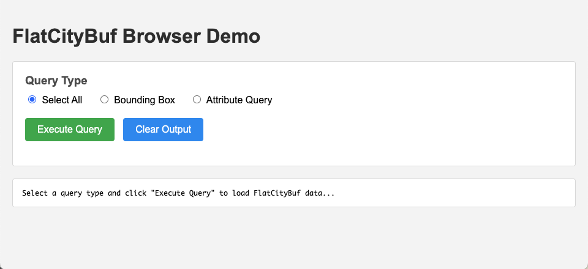

## Table of contents

{: .no_toc .text-delta }

1. TOC
{:toc}

---

## Introduction

FlatCityBuf is a cloud-optimized binary format for storing and retrieving 3D city models, combining CityJSON with FlatBuffers binary serialization and spatial indexing.

For details about FlatCityBuf's features, performance benefits, and research background, see the [FlatCityBuf overview page]({{ '/flatcitybuf/' | prepend: site.baseurl }}).

### Tutorial goals

In this tutorial, you will learn how to:

1. Convert CityJSON files to FlatCityBuf format using the CLI
2. Access and query FlatCityBuf files with Python
3. Use FlatCityBuf in web browsers with WebAssembly
4. Integrate FlatCityBuf into Rust applications
5. Optimize performance with spatial and attribute indexing

---

## Prerequisites and installation

### System requirements

Depending on your use case, you may need:

- **Rust toolchain** (1.83.0 or later) - for CLI and building from source
- **Python** (3.7 or higher) - for Python bindings
- **Node.js/npm** - for JavaScript/TypeScript usage
- **Modern web browser** - for WebAssembly applications

### Installation options

#### CLI tool

The command-line interface is useful for converting files and inspecting FCB data.

**Option 1: Install from crates.io**

```bash
cargo install fcb_cli
```

**Option 2: Build from source**

```bash
git clone https://github.com/cityjson/flatcitybuf.git
cd flatcitybuf/src/rust
cargo build --workspace --all-features --exclude fcb_wasm --release
```

The binary will be available at `target/release/fcb`.

#### Python bindings

```bash
pip install flatcitybuf
```

For development or building from source:

```bash
pip install maturin
cd flatcitybuf/src/rust/fcb_py
maturin develop --features http
```

#### JavaScript/TypeScript (npm)

```bash
npm install @cityjson/flatcitybuf
```

#### Rust library

Add to your `Cargo.toml`:

```toml
[dependencies]
fcb_core = "0.5.0"

# For HTTP support
fcb_core = { version = "0.5.0", features = ["http"] }
```

---

## Working with the CLI

The FlatCityBuf CLI provides commands for converting between formats and inspecting FCB files.

### Converting CityJSONSeq to FlatCityBuf

The most common operation is converting CityJSONTextSequences (`.city.jsonl` file) to FlatCityBuf format.

You can download a sample CityJSONTextSequences file from here: [delft.city.jsonl](https://github.com/cityjson/flatcitybuf/blob/bf270c345715e1020d314b7235ede8fffc6e0d85/examples/data/delft.city.jsonl).

#### Basic conversion

```
$ fcb ser -i delft.city.jsonl -o delft.fcb
Successfully encoded to FCB
```

This creates a FlatCityBuf file with spatial indexing enabled by default.

#### With attribute indexing

To enable fast queries on specific attributes:

```bash
$ fcb ser -i delft.city.jsonl -o delft.fcb \
  --attr-index identificatie,b3_h_dak_50p,b3_is_glas_dak \
  --attr-branching-factor 16
```

The `--attr-index` flag takes a comma-separated list of attribute names to index. The branching factor (default: 256) controls the B+tree structure—higher values mean flatter trees and faster queries but slightly larger file sizes.

#### Index all attributes

If you want to index every attribute found in the dataset:

```bash
$ fcb ser -i delft.city.jsonl -o delft.fcb -A
Successfully encoded to FCB
```

This is convenient but will increase file size and conversion time.

#### Filtering by bounding box

You can filter features during conversion to create a subset:

```bash
$ fcb ser -i delft.city.jsonl -o filtered.fcb \
  --bbox "84227.77,445377.33,85323.23,446334.69"
Successfully encoded to FCB
```

The bounding box format is: `minx,miny,maxx,maxy`

### Converting FlatCityBuf back to CityJSONSeq

To convert an FCB file back to CityJSON Text Sequences:

```bash
$ fcb deser -i delft.fcb -o delft.city.jsonl
Successfully decoded from FCB
```

### Inspecting FCB files

To view information about an FCB file:

```bash
$ fcb info -i delft.fcb
FCB File Info:
    File size: 6 MB
  Version: 2.0
  Features count: 1115
  bbox: Some(GeographicalExtent { min: Vector { x: 84501.5546875, y: 445805.03125, z: -3.746997833251953 }, max: Vector { x: 85675.234375, y: 446983.46875, z: 95.04200744628906 } })
  attr_index: []
  Title: 3DBAG
  Geographical extent:
    Min: [84501.5546875, 445805.03125, -3.746997833251953]
    Max: [85675.234375, 446983.46875, 95.04200744628906]
```

---

## Getting example data

### Download sample FlatCityBuf files

Several example FCB files are available for testing:

<!-- TODO: add actual URLs to example files -->

- **3DBAG all (70GB)**: Complete 3DBAG dataset with spati- [3DBAG all (70GB)](https://storage.googleapis.com/flatcitybuf/3dbag_all_index.fcb): serialised whole 3DBAG dataset with spatial and attribute indexing
- [3DBAG small (3.4GB)](https://storage.googleapis.com/flatcitybuf/3dbag_subset_all_index.fcb)
- [Delft (6MB)](https://github.com/cityjson/flatcitybuf/blob/bf270c345715e1020d314b7235ede8fffc6e0d85/examples/data/delft.fcb)

These files are hosted on Google Cloud Storage and can be accessed directly via HTTP.

### Creating your own FCB files

If you have CityJSON files, you first need to convert them to CityJSONTextSequences format.

For more details, see the [CityJSONSeq software page]({{ '/cityjsonseq/' | prepend: site.baseurl }})

---

## Using FlatCityBuf with Python

The Python bindings provide a convenient interface for reading and querying FlatCityBuf files.

### Basic reading

#### Opening local files

You can show metadata of FlatCityBuf file with the following code:

```python
import flatcitybuf as fcb

# Open a local FCB file
reader = fcb.Reader("delft.fcb")

# Get file information
info = reader.info()
print(f"Features: {info.feature_count}")
print(f"Bounding box: {info.bbox}")

# Get CityJSON header with transform and metadata
cityjson = reader.cityjson_header()
print(f"CityJSON version: {cityjson.version}")
print(f"Transform scale: {cityjson.transform.scale}")
print(f"Transform translate: {cityjson.transform.translate}")
```

#### Iterating through features

This will print the first 2 features:

```python
feature_count = 0
    for feature in reader:
        print(f"Feature {feature_count + 1}:")
        print(f"  ID: {feature.id}")
        print(f"  Type: {feature.type}")
        print(f"  Vertices: {len(feature.vertices)} vertices")
        print(f"  City Objects: {len(feature.city_objects)} objects")

        # Iterate over all city objects in the feature
        if feature.city_objects:
            for obj_id, city_obj in feature.city_objects.items():
                print(f"    Object ID: {obj_id}")
                print(f"    Object type: {city_obj.type}")
                print(f"    Geometries: {len(city_obj.geometry)}")

                # Show geometry with nested boundaries
                if city_obj.geometry:
                    for geom in city_obj.geometry:
                        if geom is not None:
                            print(f"      Geometry type: {geom.geometry_type}")
                            print(f"      Vertices index: {geom.vertices}")
                            print(f"      Boundaries: {geom.boundaries}")
                            if geom.semantics:
                                print(f"      Has semantics: {geom.semantics}")
                        else:
                            print("      Geometry is None")

        feature_count += 1
        # Limit output for demo
        if feature_count >= 2:
            print("  ... (showing first 2 features only)")
            break
# features will be printed here
```

### Spatial queries

FlatCityBuf's spatial indexing enables fast bounding box queries:

```python
# Query features within a bounding box
# Format: min_x, min_y, max_x, max_y
features = list(reader.query_bbox(84227.77, 445377.33, 85323.23, 446334.69))
print(f"Found {len(features)} features in bounding box")

# Process spatially filtered features
for feature in features:
    # Access only features within the specified area
    print(f"Feature {feature.id} is within the bounding box")

# This will shows like this:
# Found 101 features in bounding box
# Feature NL.IMBAG.Pand.0503100000019446 is within the bounding box
# ...
```

### Attribute queries

To query features based on attribute values, you must serialize the file with attribute indexing enabled.

```
$ fcb ser -i delft.city.jsonl -o delft.fcb -A --attr-branching-factor 16
Successfully encoded to FCB
```

Query features based on attribute values:

```python
# Create attribute filters
# Format: (attribute_name, operator, value)

# Exact match
id_filter = fcb.AttrFilter(
    "identificatie", fcb.Operator.Eq, "NL.IMBAG.Pand.0503100000019581"
)

one_building = list(reader.query_attr([id_filter]))
print(f"Found {len(one_building)} matching buildings")

# Numeric comparison
height_filter = fcb.AttrFilter("b3_h_dak_50p", fcb.Operator.Gt, 20.0)
buildings = list(reader.query_attr([height_filter]))
print(f"Found {len(buildings)} matching buildings")

# Query with multiple filters (AND logic)
tall_glass_buildings = list(
    reader.query_attr(
        [
            fcb.AttrFilter("b3_h_dak_50p", fcb.Operator.Gt, 30.0),
            fcb.AttrFilter("b3_is_glas_dak", fcb.Operator.Eq, True),
        ]
    )
)

print(f"Found {len(tall_glass_buildings)} tall glass buildings")

# This will shows like this:
# Found 1 matching buildings
# Found 4 matching buildings
# Found 0 tall glass buildings
```

#### Available operators

You can try the following operators:

```python
fcb.Operator.Eq    # Equal
fcb.Operator.Ne    # Not equal
fcb.Operator.Gt    # Greater than
fcb.Operator.Ge    # Greater than or equal
fcb.Operator.Lt    # Less than
fcb.Operator.Le    # Less than or equal
```

### HTTP and cloud access

Now you'll see the most powerful part of FlatCityBuf, retrieving data from huge remote file (70GB big!) over HTTP.

For remote FCB files, use the async reader:

<details>
<summary>Click to show example: Query a huge FlatCityBuf over HTTP in Python (async, streaming)</summary>

```python
import asyncio
import flatcitybuf as fcb

async def read_remote_fcb():
    # Create async reader for HTTP URL
    async_reader = fcb.AsyncReader(
        "https://storage.googleapis.com/flatcitybuf/3dbag_all_index.fcb"
    )
    opened_reader = await async_reader.open()

    # Get file info
    info = opened_reader.info()
    print(f"Remote file has {info.feature_count} features")

    # Get CityJSON header
    cityjson = opened_reader.cityjson_header()
    print(f"CityJSON version: {cityjson.version}")

    # Async iteration - stream features one by one
    async_iter = opened_reader.select_all()

    count = 0
    for _ in range(2):  # Get first 10 features
        feature = await async_iter.next()
        if feature is None:
            break
        print(f"Feature {count}: {feature.id}")
        count += 1

    # Async spatial query
    bbox_iter = opened_reader.query_bbox(84227.77, 445377.33, 85323.23, 446334.69)
    count = 0
    for _ in range(2):  # Get first 2 features
        feature = await bbox_iter.next()
        if feature is None:
            break
        print(f"  Spatial feature {count + 1}: {feature.id}")
        count += 1

    # Async attribute query
    id_filter = fcb.AttrFilter(
        "identificatie",
        fcb.Operator.Eq,
        "NL.IMBAG.Pand.0503100000012869",
    )
    attr_iter = opened_reader.query_attr([id_filter])
    attr_features = await attr_iter.collect()
    print(f"Found {len(attr_features)} features with specific ID")
    if attr_features:
        print(f"  Found feature: {attr_features[0].id}")

# Run the async function

if __name__ == "__main__":
    asyncio.run(read_remote_fcb())
```

</details>

```shell
python main.py
# This will shows like this in milliseconds!
# Remote file has 10771547 features
# CityJSON version: 2.0
# Feature 0: NL.IMBAG.Pand.0983100000055544
# Feature 1: NL.IMBAG.Pand.0983100000061503
#   Spatial feature 1: NL.IMBAG.Pand.0503100000014644
#   Spatial feature 2: NL.IMBAG.Pand.0503100000019937
# Found 1 features with specific ID
#   Found feature: NL.IMBAG.Pand.0503100000012869
```

No matter how big the file is, you can query it with milliseconds! :D

---

## Using FlatCityBuf in the browser (WASM)

FlatCityBuf provides WebAssembly bindings for efficient CityJSON processing in web browsers.

### Setup and installation

Install the npm package:

```bash
npm init -y # create package.json file
npm install @cityjson/flatcitybuf
```

Or include it in your `package.json`:

```json
{
  "dependencies": {
    "@cityjson/flatcitybuf": "^0.2.0"
  }
}
```

### Reading FCB files over HTTP

Create a file called `index.html` and paste the following code into it. Open the HTML file in your browser and you'll the UI like this:


You can test it to fetch data with bounding box or attribute query.

<details>
<summary>Click to show HTML to interact with FlatCityBuf over HTTP</summary>

As part of this tutorial, we'll use a minimal example file of HTML and JavaScript:

```html
<!DOCTYPE html>
<html lang="en">

<head>
  <meta charset="UTF-8">
  <meta name="viewport" content="width=device-width, initial-scale=1.0">
  <title>FlatCityBuf Browser Demo</title>
  <style>
    body {
      font-family: Arial, sans-serif;
      max-width: 1200px;
      margin: 0 auto;
      padding: 20px;
      background-color: #f5f5f5;
    }

    h1 {
      color: #333;
    }

    #controls {
      background-color: white;
      border: 1px solid #ddd;
      border-radius: 4px;
      padding: 20px;
      margin-bottom: 20px;
    }

    .control-section {
      margin-bottom: 20px;
    }

    .control-section h3 {
      margin-top: 0;
      margin-bottom: 10px;
      color: #555;
    }

    .query-type-selector {
      margin-bottom: 15px;
    }

    .query-type-selector label {
      margin-right: 20px;
      cursor: pointer;
    }

    .query-type-selector input[type="radio"] {
      margin-right: 5px;
    }

    .query-inputs {
      display: none;
      padding: 15px;
      background-color: #f9f9f9;
      border-radius: 4px;
      margin-bottom: 15px;
    }

    .query-inputs.active {
      display: block;
    }

    .query-inputs label {
      display: block;
      margin-bottom: 5px;
      font-weight: bold;
      color: #555;
    }

    .bbox-grid {
      display: grid;
      grid-template-columns: repeat(2, 1fr);
      gap: 10px;
    }

    .input-group {
      display: flex;
      flex-direction: column;
    }

    .input-group label {
      font-size: 12px;
      margin-bottom: 3px;
    }

    input[type="number"],
    input[type="text"],
    textarea {
      padding: 8px;
      border: 1px solid #ddd;
      border-radius: 4px;
      font-size: 14px;
      font-family: inherit;
    }

    textarea {
      font-family: monospace;
      resize: vertical;
    }

    button {
      background-color: #4CAF50;
      color: white;
      padding: 10px 20px;
      border: none;
      border-radius: 4px;
      cursor: pointer;
      font-size: 16px;
      margin-right: 10px;
    }

    button:hover {
      background-color: #45a049;
    }

    button:disabled {
      background-color: #cccccc;
      cursor: not-allowed;
    }

    button.secondary {
      background-color: #2196F3;
    }

    button.secondary:hover {
      background-color: #0b7dda;
    }

    #output {
      background-color: white;
      border: 1px solid #ddd;
      border-radius: 4px;
      padding: 15px;
      margin-top: 20px;
      white-space: pre-wrap;
      font-family: monospace;
      font-size: 14px;
      max-height: 600px;
      overflow-y: auto;
    }

    .error {
      color: #d32f2f;
      font-weight: bold;
    }

    .success {
      color: #388e3c;
      font-weight: bold;
    }

    .info {
      color: #1976d2;
    }
  </style>
</head>

<body>
  <h1>FlatCityBuf Browser Demo</h1>

  <div id="controls">
    <div class="control-section">
      <h3>Query Type</h3>
      <div class="query-type-selector">
        <label>
          <input type="radio" name="queryType" value="all" checked onchange="switchQueryType('all')">
          Select All
        </label>
        <label>
          <input type="radio" name="queryType" value="bbox" onchange="switchQueryType('bbox')">
          Bounding Box
        </label>
        <label>
          <input type="radio" name="queryType" value="attr" onchange="switchQueryType('attr')">
          Attribute Query
        </label>
      </div>

      <!-- Bbox query inputs -->
      <div id="bbox-query-inputs" class="query-inputs">
        <label>Bounding Box Coordinates:</label>
        <div class="bbox-grid">
          <div class="input-group">
            <label for="min-x-input">Min X:</label>
            <input type="number" id="min-x-input" step="any" value="84000" placeholder="Min X">
          </div>
          <div class="input-group">
            <label for="min-y-input">Min Y:</label>
            <input type="number" id="min-y-input" step="any" value="446000" placeholder="Min Y">
          </div>
          <div class="input-group">
            <label for="max-x-input">Max X:</label>
            <input type="number" id="max-x-input" step="any" value="85000" placeholder="Max X">
          </div>
          <div class="input-group">
            <label for="max-y-input">Max Y:</label>
            <input type="number" id="max-y-input" step="any" value="447000" placeholder="Max Y">
          </div>
        </div>
      </div>

      <!-- Attribute query inputs -->
      <div id="attr-query-inputs" class="query-inputs">
        <label for="query-input">Attribute Query (JSON array):</label>
        <textarea id="query-input" rows="4">[["identificatie", "Eq", "NL.IMBAG.Pand.0503100000012869"]]</textarea>
        <small style="color: #666; margin-top: 5px; display: block;">
          Example: [["field", "Eq", "value"], ["numeric_field", "Gt", 5.0]]<br>
          Operators: Eq, Ne, Lt, Le, Gt, Ge
        </small>
      </div>
    </div>

    <div class="control-section">
      <button id="loadBtn" onclick="loadFcbData()">Execute Query</button>
      <button class="secondary" onclick="clearOutput()">Clear Output</button>
    </div>
  </div>

  <div id="output">Select a query type and click "Execute Query" to load FlatCityBuf data...</div>

  <script type="module">
    import init, { HttpFcbReader, WasmSpatialQuery, WasmAttrQuery } from './node_modules/@cityjson/flatcitybuf/fcb_wasm.js';

    let wasmInitialized = false;
    let currentQueryType = 'all';

    // Switch query type UI
    window.switchQueryType = function (type) {
      currentQueryType = type;
      document.getElementById('bbox-query-inputs').classList.remove('active');
      document.getElementById('attr-query-inputs').classList.remove('active');

      if (type === 'bbox') {
        document.getElementById('bbox-query-inputs').classList.add('active');
      } else if (type === 'attr') {
        document.getElementById('attr-query-inputs').classList.add('active');
      }
    };

    // Clear output
    window.clearOutput = function () {
      document.getElementById('output').innerHTML = 'Output cleared. Ready for next query.';
    };

    // Main function to load FCB data
    window.loadFcbData = async function () {
      const output = document.getElementById('output');
      const btn = document.getElementById('loadBtn');

      try {
        btn.disabled = true;
        output.innerHTML = 'Starting query execution...\n';

        // Initialize the WASM module (only once)
        if (!wasmInitialized) {
          output.innerHTML += 'Initializing WASM module...\n';
          await init();
          wasmInitialized = true;
          output.innerHTML += '<span class="success">✓ WASM module initialized</span>\n\n';
        }

        // Create an HTTP FlatCityBuf reader
        output.innerHTML += 'Creating HTTP reader...\n';
        const reader = await new HttpFcbReader("https://storage.googleapis.com/flatcitybuf/3dbag_subset_all_index.fcb");
        output.innerHTML += '<span class="success">✓ Reader created</span>\n\n';

        // Get CityJSON metadata
        output.innerHTML += 'Fetching CityJSON metadata...\n';
        const metadata = await reader.cityjson();
        output.innerHTML += '<span class="success">✓ Metadata loaded</span>\n';
        output.innerHTML += `Version: ${metadata.version}\n`;
        if (metadata.transform) {
          output.innerHTML += `Transform: ${JSON.stringify(metadata.transform, null, 2)}\n`;
        }
        output.innerHTML += '\n';

        // Execute query based on selected type
        let iter;
        if (currentQueryType === 'all') {
          output.innerHTML += '<span class="info">Query Type: SELECT ALL</span>\n';
          iter = await reader.select_all();
        } else if (currentQueryType === 'bbox') {
          const minX = parseFloat(document.getElementById('min-x-input').value);
          const minY = parseFloat(document.getElementById('min-y-input').value);
          const maxX = parseFloat(document.getElementById('max-x-input').value);
          const maxY = parseFloat(document.getElementById('max-y-input').value);

          if (isNaN(minX) || isNaN(minY) || isNaN(maxX) || isNaN(maxY)) {
            output.innerHTML += '<span class="error">Error: Invalid bbox coordinates. Please enter valid numbers.</span>\n';
            return;
          }

          output.innerHTML += '<span class="info">Query Type: BOUNDING BOX</span>\n';
          output.innerHTML += `BBox: [${minX}, ${minY}, ${maxX}, ${maxY}]\n\n`;

          const queryObject = {
            type: 'bbox',
            minX: minX,
            minY: minY,
            maxX: maxX,
            maxY: maxY
          };

          const spatialQuery = new WasmSpatialQuery(queryObject);
          iter = await reader.select_spatial(spatialQuery);
        } else if (currentQueryType === 'attr') {
          const queryInput = document.getElementById('query-input');
          const queryStr = queryInput.value.trim();

          let queryArray;
          try {
            queryArray = JSON.parse(queryStr);
          } catch (e) {
            output.innerHTML += `<span class="error">Error: Invalid JSON for query: ${e.message}</span>\n`;
            return;
          }

          output.innerHTML += '<span class="info">Query Type: ATTRIBUTE QUERY</span>\n';
          output.innerHTML += `Query: ${JSON.stringify(queryArray, null, 2)}\n\n`;

          const attrQuery = new WasmAttrQuery(queryArray);
          iter = await reader.select_attr_query(attrQuery);
        }

        const count = iter.features_count();
        output.innerHTML += `<span class="success">✓ Found ${count !== undefined ? count : 'unknown number of'} features</span>\n\n`;

        // Process features
        output.innerHTML += '=== Features ===\n';
        let featureNum = 0;
        let feature;

        while ((feature = await iter.next()) !== undefined) {
          featureNum++;
          output.innerHTML += `\n--- Feature ${featureNum} ---\n`;
          output.innerHTML += `ID: ${feature.id || 'N/A'}\n`;
          output.innerHTML += `Type: ${feature.type || 'N/A'}\n`;

          if (feature.city_objects) {
            const coCount = Object.keys(feature.city_objects).length;
            output.innerHTML += `City objects: ${coCount} object(s)\n`;
            // Show first few object IDs
            const firstObjs = Object.keys(feature.city_objects).slice(0, 3);
            if (firstObjs.length > 0) {
              output.innerHTML += `  Sample IDs: ${firstObjs.join(', ')}\n`;
            }
          }

          if (feature.vertices) {
            output.innerHTML += `Vertices: ${feature.vertices.length} vertices\n`;
          }

          if (feature.attributes) {
            output.innerHTML += `Attributes: ${JSON.stringify(feature.attributes, null, 2)}\n`;
          }

          // Limit output to first 10 features to avoid overwhelming the page
          if (featureNum >= 10) {
            output.innerHTML += `\n<span class="info">... (showing first 10 of ${count !== undefined ? count : 'many'} features)</span>\n`;
            break;
          }

          // Auto-scroll to bottom
          output.scrollTop = output.scrollHeight;
        }

        if (featureNum === 0) {
          output.innerHTML += '\n<span class="info">No features found matching the query.</span>\n';
        }

        output.innerHTML += '\n<span class="success">✓ Query Complete!</span>\n';

      } catch (error) {
        output.innerHTML += `\n<span class="error">✗ Error: ${error.message}</span>\n`;
        output.innerHTML += `\nStack trace:\n${error.stack}\n`;
        console.error('Error details:', error);
      } finally {
        btn.disabled = false;
        output.scrollTop = output.scrollHeight;
      }
    };
  </script>
</body>

</html>
```

</details>

---

## Using FlatCityBuf with Rust

For maximum performance and control, you can use FlatCityBuf directly in Rust applications.

### Adding to your project

Init a new Rust project:

```bash
cargo new fcb_demo
cd fcb_demo
```

Add FlatCityBuf to your `Cargo.toml`:

```toml
[dependencies]
fcb_core = "0.5.0"

# For HTTP support
fcb_core = { version = "0.5.0", features = ["http"] }

```

### Reading FCB files

### Spatial queries

Use bounding box queries with the packed R-tree index:

```rust
use fcb_core::{FcbReader, packed_rtree::Query};
use std::fs::File;
use std::io::BufReader;

fn main() -> Result<(), Box<dyn std::error::Error>> {
    let input_file = File::open("../delft.fcb")?;
    let input_reader = BufReader::new(input_file);

    // Define bounding box
    let minx = 84227.77;
    let miny = 445377.33;
    let maxx = 85323.23;
    let maxy = 446334.69;

    let mut reader = FcbReader::open(input_reader)?.select_query(
        Query::BBox(minx, miny, maxx, maxy),
        None,
        None,
    )?;

    let mut count = 0;
    while let Some(feature_buf) = reader.next()? {
        let cj_feature = feature_buf.cur_cj_feature()?;
        println!("Feature in bbox: {}", cj_feature.id);
        count += 1;
    }

    println!("Found {} features in bounding box", count);

    Ok(())
}

```

then run it with:

```bash
cargo run
```

### HTTP streaming

For cloud-based FCB files, use the async HTTP reader:
Don't forget to add `tokio` to your `Cargo.toml`:

```toml
[dependencies]
tokio = { version = "1.48.0", features = ["rt-multi-thread", "macros"] }

```

```rust
use fcb_core::{FcbReader, HttpFcbReader, packed_rtree::Query};
use std::fs::File;
use std::io::BufReader;

#[tokio::main]
async fn main() -> Result<(), Box<dyn std::error::Error>> {
    let http_reader =
        HttpFcbReader::open("https://storage.googleapis.com/flatcitybuf/3dbag_all_index.fcb")
            .await?;

    // Get header information
    let header = http_reader.header();
    println!("Features: {}", header.features_count());

    // Spatial query over HTTP
    let minx = 84227.77;
    let miny = 445377.33;
    let maxx = 85323.23;
    let maxy = 446334.69;

    let mut iter = http_reader
        .select_query(Query::BBox(minx, miny, maxx, maxy))
        .await?;

    while let Some(feature) = iter.next().await? {
        let cj_feature = feature.cj_feature()?;
        println!("Feature: {}", cj_feature.id);
    }

    Ok(())
}

```

---

## Performance tips and best practices

### Indexing tips

#### Branching factor considerations for attribute indexing

The branching factor controls B+tree structure:

```bash
# Default (256) - good for most cases
fcb ser -i data.city.jsonl -o data.fcb --attr-index height

# Higher (512) - faster queries, slightly larger files
fcb ser -i data.city.jsonl -o data.fcb \
  --attr-index height --attr-branching-factor 512

# Lower (128) - smaller files, slightly slower queries
fcb ser -i data.city.jsonl -o data.fcb \
  --attr-index height --attr-branching-factor 128
```

The larger the branching factor, the more nodes are fetch per one round trip to the server. In many case especially over HTTP, the round trip time dominates the total time more than the time to fetch redundant nodes.

**Recommendations:**

- **Default (256)**: Good balance for most datasets
- **Higher (512-1024)**: For query-heavy applications with huge datasets (100GB or more)
- **Lower (64-128)**: For datasets with relatively small size (10GB or less)

#### Cardinality of attributes

Since the attribute index is a B+tree, the attribute having higher cardinality (more unique values) will be better for indexing while lower cardinality attributes will be less efficient or sometimes not worth indexing. As extreme example, if you have an attribute with only 2 unique values (e.g. true/false), you don't get any benefit from indexing it.

### HTTP and cloud optimization

#### Range request batching

Once the reader is initialised, the reader fetch features from the server when it's called with `next()` method or relevant iterators (depending on which language you are using). If you use something like `collect()`, this fetch all features at once, which is not efficient. We recommend to use streaming approach instead (use `next` to fetch features when needed)

**Good:**

```python
reader = reader.select_all()
for feature in reader:
    process(feature)
```

**Avoid:**

```python
reader = reader.select_all().collect()
all_features = list(reader)
```

### Zero-copy benefits

Especially when you use FlatCityBuf in Rust, there are two ways to access data:

1. Use `cur_feature()` method to get the current feature in FlatBuffer format
2. Use `cur_cj_feature()` method to get the current feature in CityJSON format

The first one returns in FlatBuffer format and achieves zero-copy deserialization. If you access to the specific field of the feature, only that field is loaded. On the other hand, the second one returns features in CityJSON format, which internally parse FlatBuffers into CityJSON objects (not zero-copy). You choose proper one based on your use case.

**Zero-copy deserialization:**

```rust
while let Some(feature_buf) = reader.next()? {
    let cj_feature = feature_buf.cur_feature()?; // You get flatbuffer feature
    process(&cj_feature);
}
```

**Not zero-copy deserialization:**

```rust
while let Some(feature_buf) = reader.next()? {
    let cj_feature = feature_buf.cur_cj_feature()?;
    process(&cj_feature);
}
```

---

### Frequently asked questions

#### Can I edit FCB files directly?

No, FCB files are binary and not designed for direct editing. To modify data:

1. Convert FCB back to CityJSONSeq: `fcb deser -i data.fcb -o data.city.jsonl`
2. Edit the CityJSONSeq file
3. Convert back to FCB: `fcb ser -i data.city.jsonl -o data.fcb`

#### How do I update a single feature?

FCB files are immutable. To update features, you must regenerate the entire file. For frequently updated data, consider:

- Keeping source data in CityJSONSeq format
- Regenerating FCB files periodically
- Using FCB for read-heavy, write-light scenarios

#### What's the maximum file size?

FlatCityBuf has been tested with files up to 70GB (complete 3DBAG dataset). Theoretical limits are much higher, constrained mainly by:

- Available disk space
- Memory for index construction during writing
- HTTP server capabilities for remote access

#### Can I use FCB with other GIS tools?

Currently, FCB is primarily used with its own libraries.

#### How do I choose between CityJSON and FlatCityBuf?

Use **CityJSON/CityJSONSeq** when:

- Files are small (<1GB)
- Human readability is important
- Frequent editing is needed
- Maximum tool compatibility is required

Use **FlatCityBuf** when:

- Files are large (>1GB)
- Read performance is critical
- Spatial/attribute queries are needed
- Cloud/HTTP access is required

#### Does FlatCityBuf support textures and appearances?

Yes, FlatCityBuf preserves all CityJSON data including textures and appearances.
